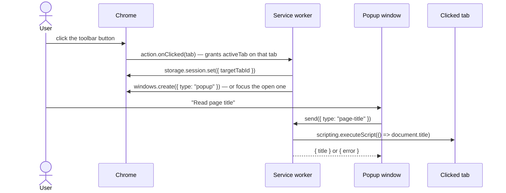

# Architecture

A Manifest V3 Chrome extension written in strict TypeScript with vanilla DOM (no UI framework) and **no runtime dependencies**. [Vite](https://vite.dev) builds it into a plain, readable extension folder (`dist/prod`). Everything below points at code in this repository; when this page and the code disagree, the code wins.

Related docs: [INSTALL.md](INSTALL.md) · [USAGE.md](USAGE.md) (turning the starter into your extension) · [BUILD.md](BUILD.md) · [TESTING.md](TESTING.md).

## Layering — the one rule that shapes the tree

```text
src/lib/**         GENERIC — imports nothing from src/app, src/pages, src/background
tooling/**         GENERIC — Vite plugins, same rule
src/app/**         the extension's domain: pure logic (no DOM) + the typed wiring of lib pieces
src/background/**  service worker: chrome.* effects, thin
src/pages/**       UI: DOM + chrome.* effects, thin
```

Generic means: copy the folder into another extension and it works. Enforced mechanically, not by convention:

- `tests/structure/lib-boundary.test.ts` and the `noRestrictedImports` override in `biome.json` — generic code may not import extension code.
- `tests/structure/no-import-cycles.test.ts` — no runtime import cycles under `src/` or `tooling/`.
- `biome.json` `useBlockStatements` — braces on every `if`.

Working rules for new code: one file, one job (soft cap ~300 lines); decisions are pure functions, DOM / `chrome.*` code around them only reads inputs and applies results; every unit has its own test file in the matching `tests/` folder; module state has one owner and is exposed through functions, never an exported `let`.

## Runtime surfaces

| Surface | Entry | Role |
|---|---|---|
| Service worker | `src/background/service-worker.ts` | Registers every chrome event listener synchronously at module top level (MV3 requirement), then delegates. No logic. |
| Popup window | `src/pages/popup/main.ts` + `index.html` | The main UI — a `chrome.windows` window of type `popup`, opened by the worker on the toolbar click. Has its own close button (`window.close()`). |
| Options page | `src/pages/options/main.ts` + `index.html` | Edits the `name` pref. |

The manifest is code: `src/manifest.ts` exports `manifest(version, target = "chrome")`, emitted as `manifest.json` by the build. There is deliberately no `action.default_popup`: without one, Chrome fires `action.onClicked`, the worker is in the loop, and the click grants `activeTab`. No host permissions, no content scripts. The extension makes **zero network requests**; `tests/e2e/smoke.spec.ts` asserts it on the built extension and `tests/structure/release-snapshot.test.ts` audits the release zip for network or dev-loop code.

## Service worker (`src/background/`)

| Module | Owns |
|---|---|
| `service-worker.ts` | entry: all listener registrations, no logic |
| `messages.ts` | `handleMessage`: exhaustive `switch` over the `Message` union; the `scripting` demo |

The worker is stateless across suspensions — Chrome stops it after ~30 idle seconds and module variables are gone. Whatever must survive lives in storage: the clicked tab's id goes to `chrome.storage.session`, and "is the popup already open?" is asked of Chrome (`runtime.getContexts`) instead of remembered.

Add a file per feature here as the worker grows (`alarms.ts`, `context-menus.ts`, …); `service-worker.ts` stays a list of registrations.

## Generic library (`src/lib/`)

| Module | What it is |
|---|---|
| `messaging.ts` | `createMessenger<Message, Responses>()` → typed `send()` for pages and `listen(handler)` for the worker. A message type without a response entry does not compile; a throwing handler answers `{ error }`. |
| `storage.ts` | `createStorage<Schema>(area)` → typed `get` / `set` / `remove` over `chrome.storage[area]`. |
| `env.ts` | `IS_DEV` (unpacked copy = no `update_url`), `DEV_PREFIX`, `markDevPage()`, `markDevAction()` (dev icon + badge), `getReleaseVersion()`. |
| `platform/popup-window.ts` | `openPopupWindow(path, { width, height, top? })` — single-instance extension window, centred horizontally over the focused browser window, `top` px below its top edge. |
| `platform/panel.ts`, `platform/favicon.ts`, `platform/capabilities.ts` | Side-panel open / toolbar behaviour, `_favicon/` URLs, feature detection. Not used by the demo; ready for the `sidePanel` / `favicon` / `tabGroups` permissions. |
| `ui/ask-dialog.ts` | confirm / prompt on the native `<dialog>` |
| `ui/toast.ts` | transient message in the page's `#toast` element |
| `dom.ts` | `getElementById<T>`, `closest(eventTarget, selector)`, `mustQuery` |

`lib/ui` ships no CSS — `src/styles/common.css` styles the ids the widgets create. The extension binds the library in `src/app/`: `messages.ts` (the `Message` union, `MessageResponses`, `send`, `listen`) and `storage.ts` (the two schemas, `localStore`, `sessionStore`, `loadName`, `loadFeatures`).

## Data flow

```text
toolbar click ── action.onClicked ──► worker ── sessionStore.set({ targetTabId }) + openPopupWindow()
popup ── send(Message) ──► worker (messages.ts) ── scripting.executeScript ──► the clicked tab
popup / options ◄── chrome.storage.onChanged ── localStore.set({ name }) from either page
```



Design choices that matter:

- **Pages never tell each other anything.** They write storage and re-render on `storage.onChanged` — the same path covers a change made from another page, another window or the worker.
- **Errors are values on the wire.** `listen()` turns a throw into `{ error }`; `send()` callers narrow `undefined | { error } | answer`.
- **Feature flags** live in `features.json`, shipped with the build; unknown flags read as disabled (`loadFeatures`).

## Storage and messages

The types are the authoritative definitions — they are not repeated here:

- storage keys and shapes: `LocalStorageSchema`, `SessionStorageSchema` in `src/app/storage.ts`
- messages and their responses: `Message`, `MessageResponses` in `src/app/messages.ts`

## Build, dev loop, release

How to run it: [BUILD.md](BUILD.md). This section is about where each piece lives.

| Piece | File |
|---|---|
| Build config — pages as Vite root (so they land at `popup/index.html`, `options/index.html`), worker as a third entry with a stable name, unhashed readable output, `base: "./"`, no module-preload polyfill (MV3 CSP), `target: chrome121`, unminified unless `MINIFY=1` | `vite.config.ts` |
| Emits `manifest.json` from `src/manifest.ts`; the version lives in `package.json` only | `tooling/manifest-plugin.ts` |
| Emits root files the runtime fetches (`features.json`) and dev-only icons (`dev-assets/`) | `tooling/static-files-plugin.ts` |
| Dev loop: in a development watch build, serves an HTTP long-poll; after each rebuild open extension pages reload themselves, or call `chrome.runtime.reload()` when the worker, manifest or shared code changed. Never part of a production build. | `tooling/dev-reload-plugin.ts`, pure part in `tooling/dev-reload-core.ts` |
| Release gate: version newer than the last `release-v*` tag, CHANGES entry present, CHANGES commit hashes valid, `just check`, real-browser tier, pack, e2e smoke on the packed build | `scripts/build.sh`, `scripts/validate_*.sh`, `scripts/pack.sh` |
| Task runner | `justfile` |
| Lint + format | `biome.json` |
| Type check (strict, `noUncheckedIndexedAccess`, `erasableSyntaxOnly`, no emit — Vite transpiles, `tsc` only checks) | `tsconfig.json` |

## Tests

`tests/` mirrors `src/`, plus `tests/structure` (repo-wide guards and release packaging), `tests/browser` (real Chromium) and `tests/e2e` (Playwright on the built extension). Details: [TESTING.md](TESTING.md).
